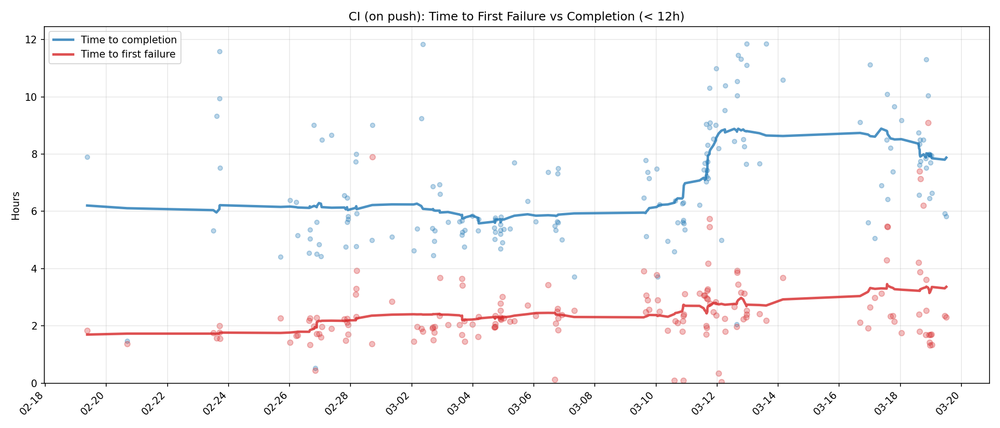
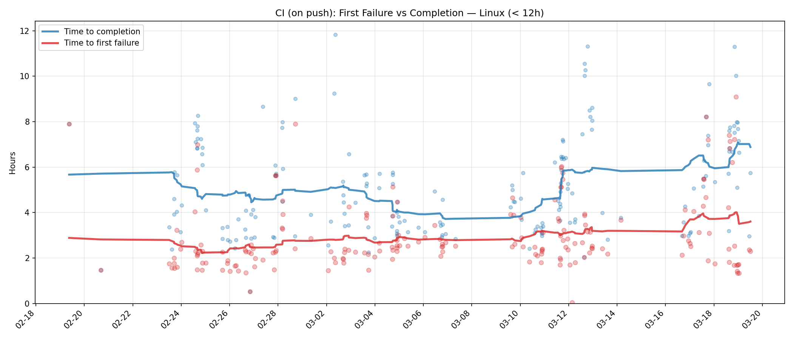
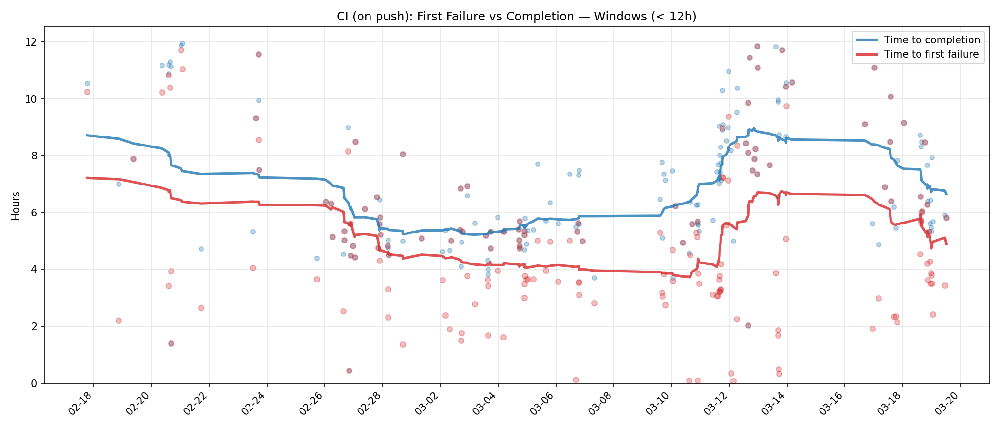
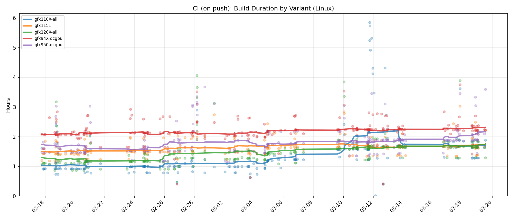
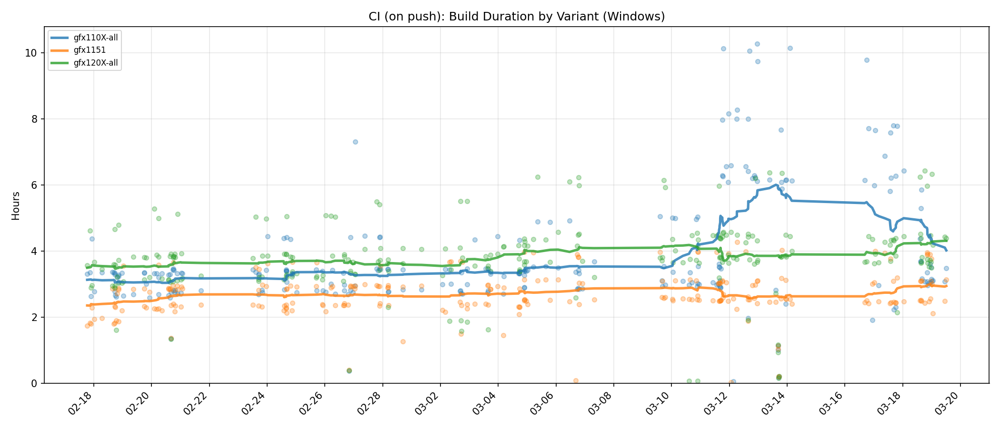
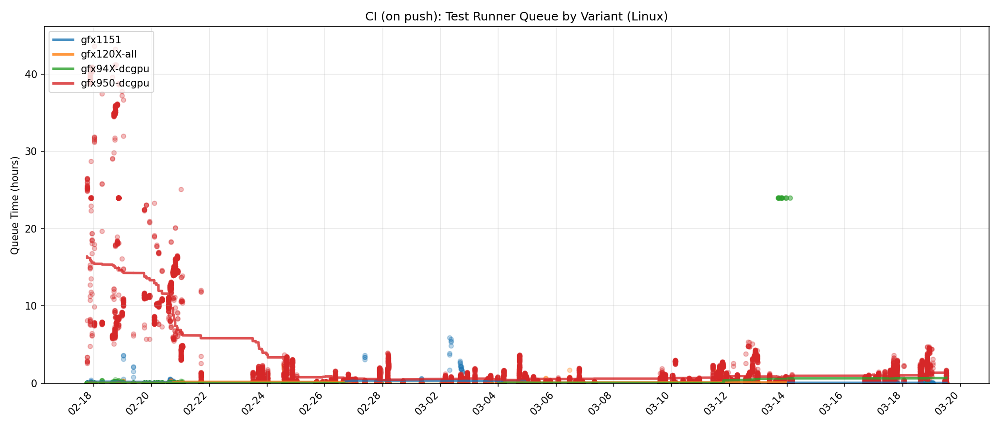
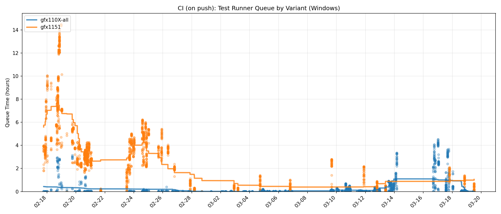
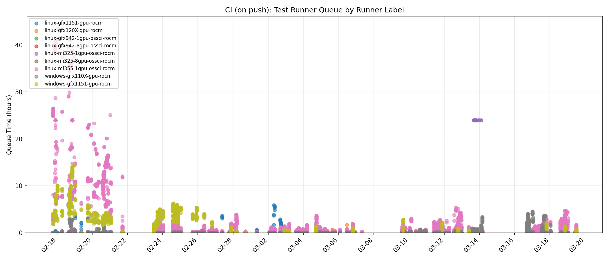
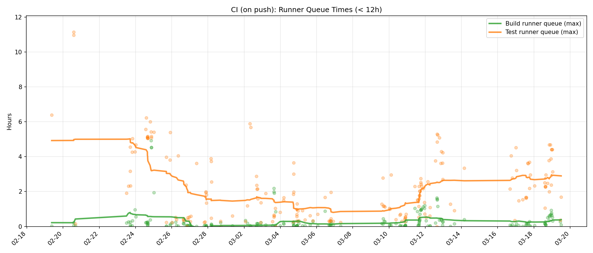

# CI Metrics

Scripts for collecting and visualizing TheRock CI timing data from GitHub Actions.

## Scripts

- `ci_time_to_signal.py` — Collects per-run and per-job timing data via `gh` CLI
- `ci_time_to_signal_plots.py` — Generates plots from collected CSV data

## Quick Start

### 1. Collect data

```bash
# Collect last 30 days of push events on main (takes ~10 min for ~290 runs)
python prototypes/ci-metrics/ci_time_to_signal.py \
  --days 30 --branch main --events push \
  --output data/ci_timing_30d.csv \
  --jobs-output data/ci_jobs_30d.csv
```

The runs CSV (`ci_timing_30d.csv`, ~120KB) has one row per workflow run with
wall time, time to first failure, queue times, and job counts.

The jobs CSV (`ci_jobs_30d.csv`, ~8MB) has one row per job with platform,
variant, queue time, duration, and runner labels. This is needed for
per-platform and per-variant breakdowns.

### 2. Generate plots

```bash
python prototypes/ci-metrics/ci_time_to_signal_plots.py \
  data/ci_timing_30d.csv \
  --jobs-csv data/ci_jobs_30d.csv \
  --output-dir data/plots
```

### 3. Resume interrupted collection

If the GitHub API returns errors mid-collection, re-run with `--resume` and the
same output paths. Already-fetched runs are skipped:

```bash
python prototypes/ci-metrics/ci_time_to_signal.py \
  --days 30 --branch main --events push \
  --output data/ci_timing_30d.csv \
  --jobs-output data/ci_jobs_30d.csv \
  --resume
```

## Data Filtering

Two layers of filtering keep the data and plots focused on meaningful CI runs:

**Skipped run detection:** Some CI runs exit early when only docs or other
non-build files changed. The collector marks a run as "skipped" if it has ≤2
non-skipped jobs and a wall time under 5 minutes. Skipped runs are excluded
from all summary statistics and plots.

**12-hour outlier cutoff:** Several plots are generated in both unfiltered and
filtered (`_filtered` suffix) variants. The filtered versions exclude runs
where the plotted metric exceeds 12 hours. This removes queue-starvation
episodes and timeout outliers (e.g. 40h+ gfx950 test queues in mid-Feb) so the
plots focus on typical CI behavior rather than infrastructure outages.

## Data Snapshots

### 2026-03-19 (30 days, push events on main)

Collected 292 runs (249 non-skipped) from 2026-02-17 to 2026-03-19.

Summary:

| Metric | Median | Max |
|--------|--------|-----|
| Time to completion | 8h19m | 72h33m |
| Time to first failure | 2h09m | 60h34m |
| Max queue time | 2h28m | 43h39m |
| Failure rate | 69% (171/249) | — |

#### Key plots

**Time to first failure vs completion (all platforms, filtered < 12h):**



**Linux — first failure vs completion (filtered < 12h):**



**Windows — first failure vs completion (filtered < 12h):**



**Build duration by variant (Linux):**



**Build duration by variant (Windows):**



**Test runner queue by variant (Linux):**



**Test runner queue by variant (Windows):**



**Test runner queue by runner label:**



**Runner queue times — build vs test (filtered < 12h):**


