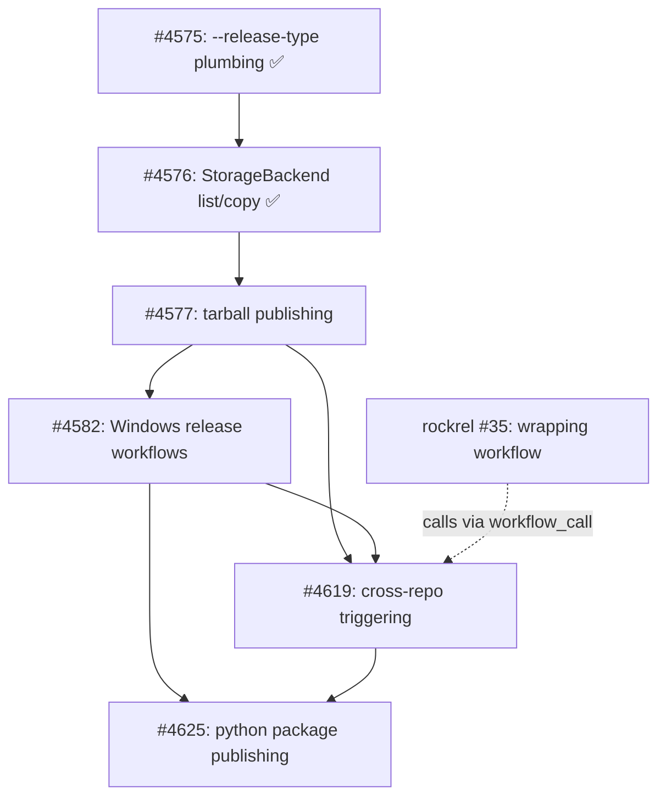

# Multi-Arch Release PR Stack

```mermaid
graph TD
    A["#4575: --release-type plumbing ✅"] --> B
    B["#4576: StorageBackend list/copy ✅"] --> C
    C["#4577: tarball publishing"] --> D
    C --> E
    D["#4582: Windows release workflows"] --> E
    D --> F
    E["#4619: cross-repo triggering"] --> F
    F["#4625: python package publishing"]

    G["rockrel #35: wrapping workflow"] -.->|"calls via workflow_call"| E
```
